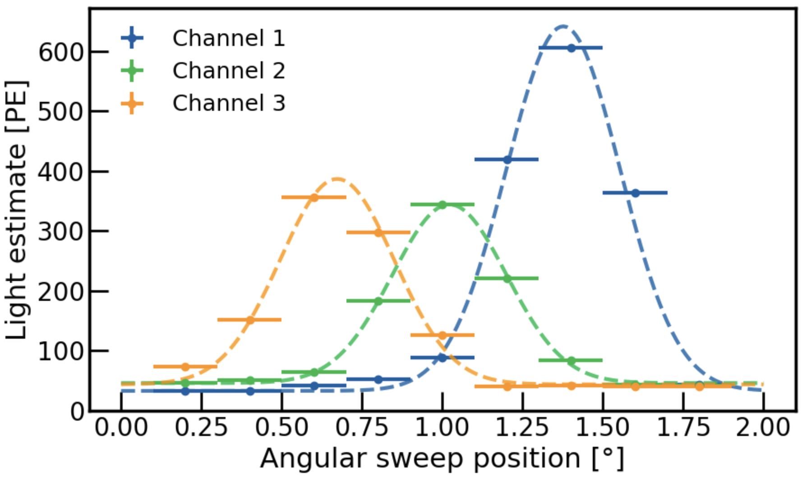
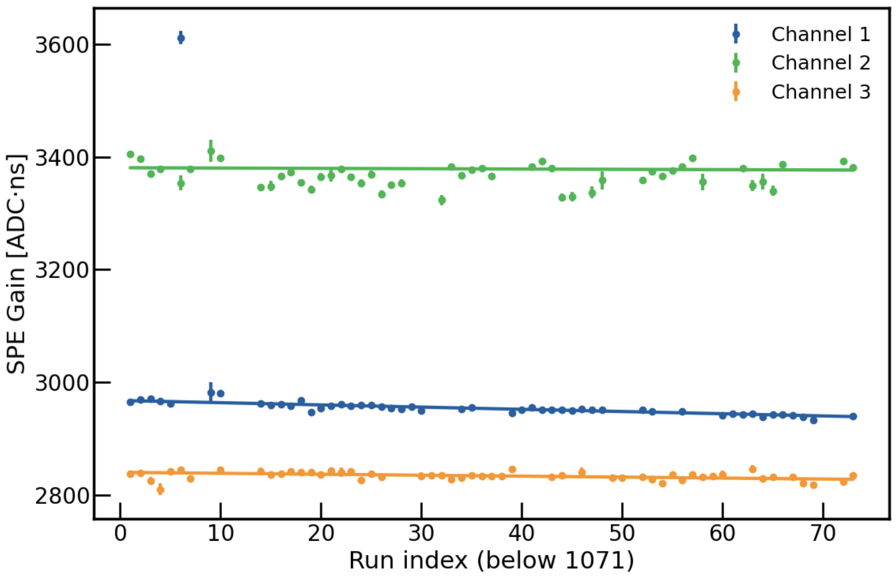
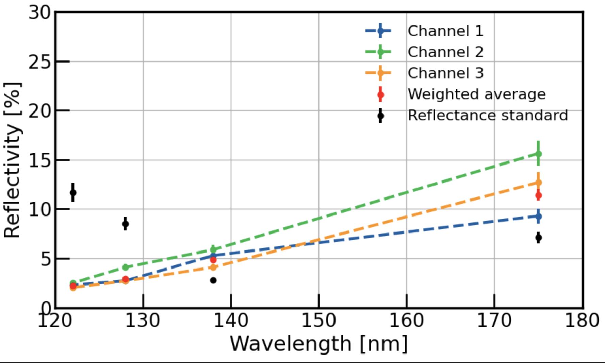

# VULCAN — Vacuum Ultraviolet Light Characterisation At Nikhef

Custom VUV reflectometry setup built at Nikhef to measure how detector materials reflect light at wavelengths where standard spectrophotometers have no sensitivity — down to 122 nm, where even air absorbs the beam. The setup uses a deuterium lamp, monochromator, vacuum chamber, and three-channel SiPM readout. Samples are rotated through an angular sweep and the reflected light distribution is fit with a Gaussian to extract the absolute reflectivity.

**Key result:** Reflectivity of an aluminium detector component measured at 122, 128, 138, and 175 nm. At 128 nm — the argon scintillation wavelength — specular reflectivity is 3.0 ± 0.1%, and drops further towards shorter wavelengths, demonstrating that detector materials exhibit strongly wavelength-dependent and non-trivial reflective behaviour in the deep UV. This cannot be assumed from visible-light measurements and requires dedicated characterisation for accurate photon transport simulations. Results directly updated simulation inputs used across the DUNE collaboration.

**Angular sweep — example measurement**

**SiPM gain stability across the measurement campaign**

**Final reflectivity result vs wavelength**

## Analysis
- SiPM waveform processing and multi-Gaussian SPE calibration per run
- Gain stability monitoring across 200+ runs
- Shared-width Gaussian fitting of angular sweep data across three channels simultaneously
- Instrument corrections for grating efficiency, lamp spectrum, and SiPM quantum efficiency
- Absolute reflectivity extraction via normalisation to a calibrated reflectance standard

## Tools
Python · NumPy · Matplotlib · strax · SciPy · pandas
